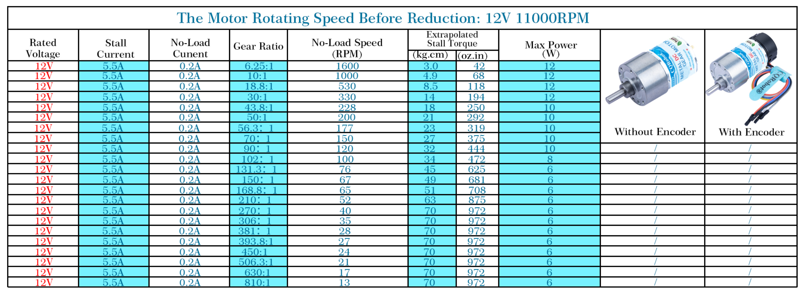
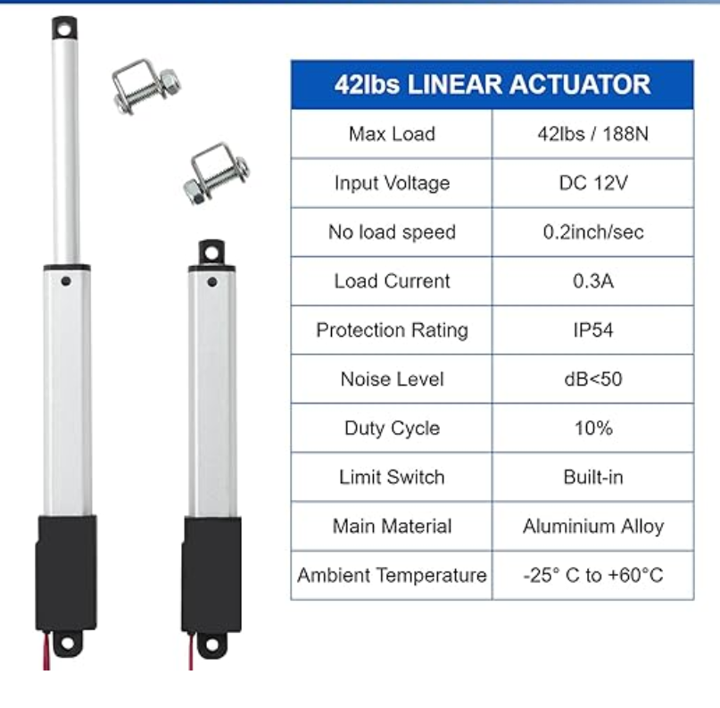
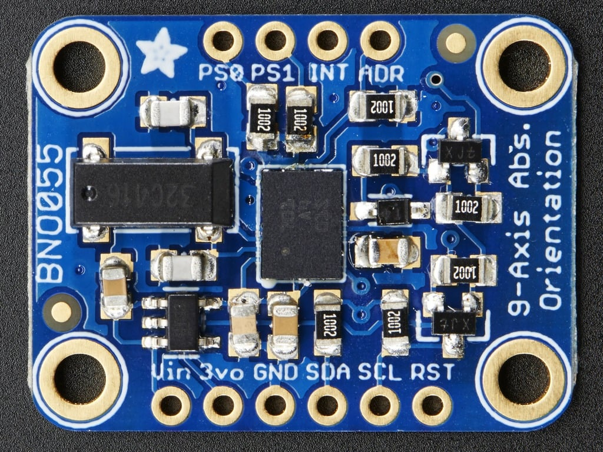
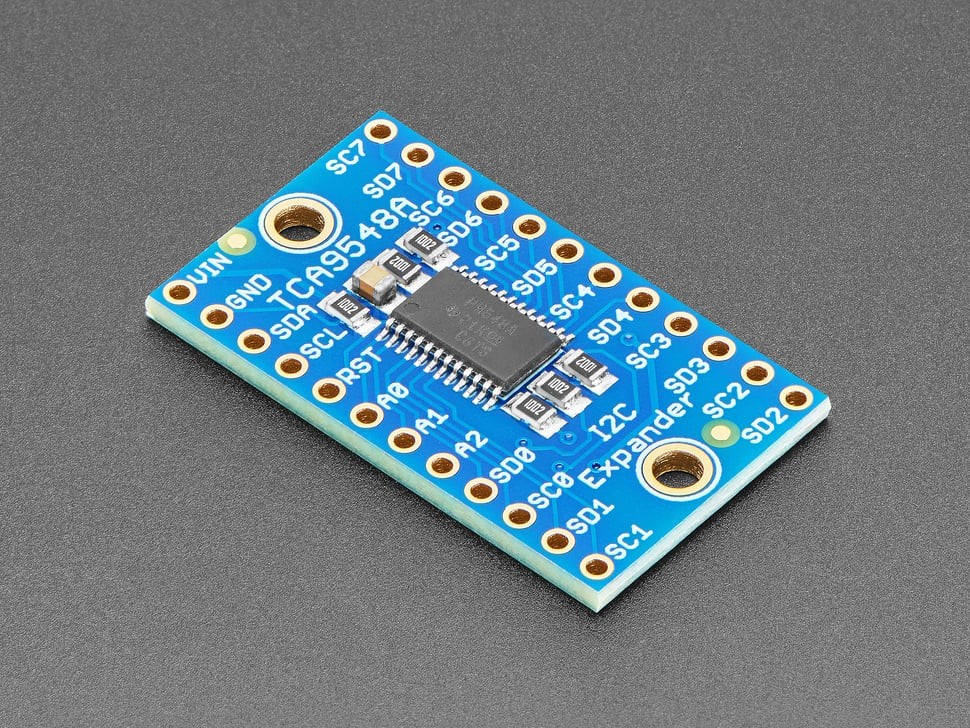
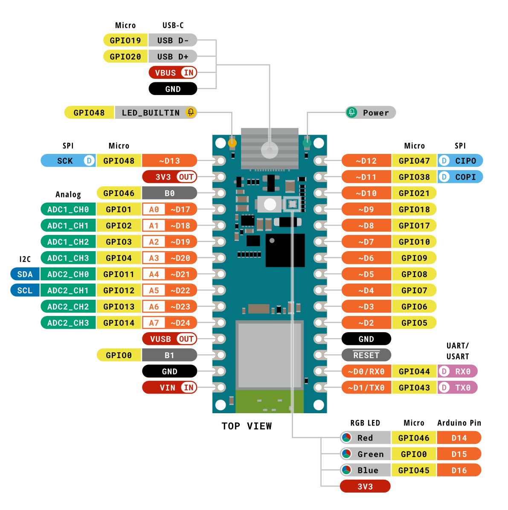

Motors
===

[Documentation](http://www.cqrobot.wiki/index.php/DC_Gearmotor_SKU:_CQR37D)

<!-- end_slide -->
Motor Specs
===

<!-- end_slide -->

[Linear Actuators](https://www.amazon.com/JQDML-Linear-Actuator-Stroke-Pushing/dp/B09YQYRHB9)
===

Using the same motor drivers

<!-- end_slide -->
[IMUs - BNO055](https://learn.adafruit.com/adafruit-bno055-absolute-orientation-sensor/overview)
===

- Integrates accelerometer, gyroscope, and magnetometer with processor for sensor fusion
- Outputs absolute orientation data, reducing the need for complex sensor fusion algorithms on the microcontroller
- Using more than 2 requires I2C multiplexer
  - You can change the address by applying a voltage to the ADR pin, but only allows for 2 IMUs

Multiplexer - TCA9548A
===

- 1-to-8
<!-- end_slide -->
Pin Requirements
===

- Motor Drivers: 2 PWM pins each
- Encoders: 2 digital pins each
- Multiplexer:  
- IMUs: SDA and SCL pins
- [EMGs](https://wiki.seeedstudio.com/Grove-EMG_Detector/): ADC pin each

<!-- end_slide -->
Microcontroller: Arduino Nano ESP32
===

- Only capable of 5 simultaneous PWM outputs

<!-- end_slide -->
Power
===

- 12 V 3A DC power supply
- LM7805 voltage regulator

<!-- end_slide -->

Control
===

- Send angle wirelessly to microcontroller
  - Probably bluetooth
- PID to move motors to correct position

<!-- end_slide -->
